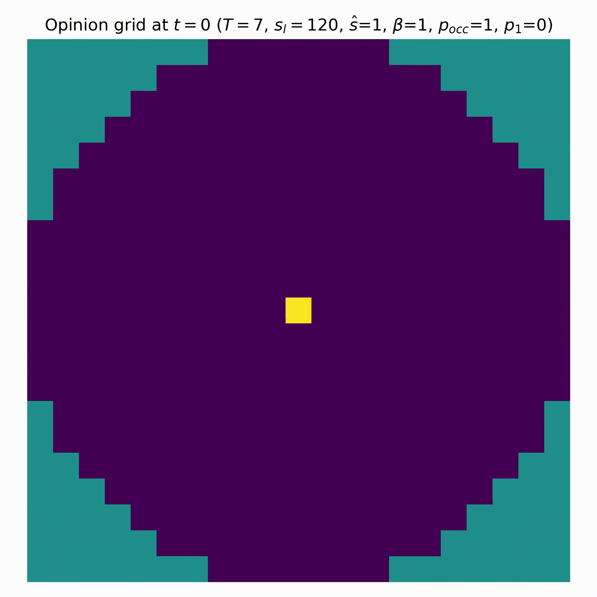
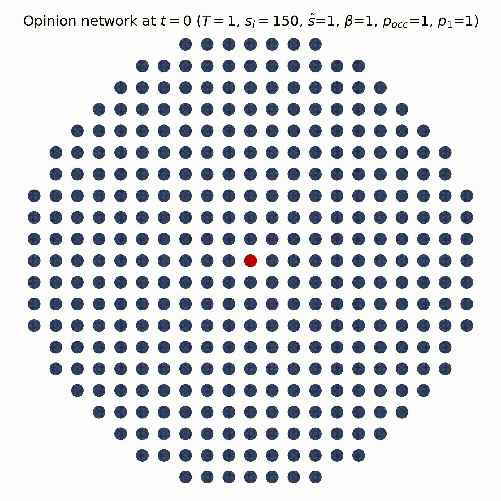

## Emerging patterns of opinion formation in social structures

Research Project by Pablo Rodriguez Alves, Chayenne Olumuyiwa, Jonas Schäfer, Mingjie Li

Heavily based on [social impact theory](https://psycnet.apa.org/doi/10.1037/0003-066X.36.4.343) and [this opinion formation paper](https://doi.org/10.1016/S0378-4371(00)00282-X).

### Initialization

Recommended: To set up using **conda** enter `conda env create --yes -f environment.yml` and activate using `conda activate css-project`

_Alternative_: Using **pip** only, start by creating a virtual environment `python -m venv .venv`, activate it using `source .venv/bin/activate` and run `pip install -r requirements.txt` to initialize the environment

### Results

The research and major results have been summarized and can be viewed in the [presentation file](Complex%20System%20Presentation.pdf) which you can [download here](https://raw.githubusercontent.com/jonas4climate/opinion-formation-complexity/main/Complex%20System%20Presentation.pdf).

Many visualizations and results can be found in the [figures folder](./figures/), such as:

|  |  |  |
|:---:|:---:|:---:|
| Oscillations of leader influence (center node) in stochastic cellular automata | Self-organized criticality on stochastic cellular automata | Unification near critical temperature on network (visualized on lattice) |

### References

More references can be found under [references.md](./references.md)